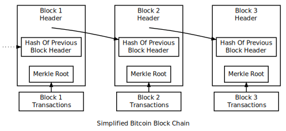
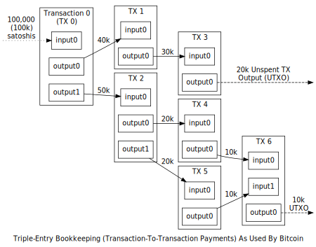

## 区块链 | Block Chain

区块链是所有交易保持有序及时序的一个记录，它为比特币提供了公开的账本。这套系统被用于防止双花和对之前交易的修改。

在比特币网络中的每个完全节点存储着一个区块链，只包含被该节点验证过的区块。当多个节点在其区块链中都有了同样的区块时，他们被认为是[一致的](TOADD)（consensus）。这些节点用来维持一致性的验证规则被称作[一致性规则](TOADD)（consensus rules）。本节会涉及很多关于一致性规则的描述，而其被 Bitcoin Core 所使用。

### 区块链总览 | Block Chain Overview

上图展现了一个简化版的区块链。一个或多个新的交易被收集到一起成为了一个[区块](TOADD)（block）的交易数据部分。每个交易的副本都会被哈希，然后这些哈希被配对，被哈希，再配对，再哈希，直到只有一个哈希值，这就是 merkle 树的 merkle 根节点。

merkle 根节点存储在区块头。每个区块同时存储着上一个区块头的哈希值，从而将区块连接成链。这样确保了一个交易在没有对纪录其的区块及所有之后区块更改前是不可被更改的。

交易也是被链在一起的。比特币钱包给人的印象是聪（satoshis）从钱包发出再到钱包，然而比特币实际上是从一个交易到另一个交易。每笔交易花费着从之前的一笔或多笔交易中收到的聪，所以一笔交易的输入是上一笔交易的输出。

一笔交易可以有多个输出，就好像同时发送给多个地址一样，但是在区块链中一笔交易的每个输出只能被当作输入使用一次。任何后续的引用都是被禁止的双花（一种将同一笔聪花费两次的尝试）。

输出与交易 id（TXIDs）绑定在一起，交易 id 是签名的交易的哈希值。

因为一笔交易的每个输出只能被花费一次，所以在区块链中的所有交易的输出可以被分类为已花费交易输出和未花费交易输出（UTXOs）。为了让支付有效，必须使用 UTXOs 作为输入。

除了 coinbase 交易（稍后描述）外，如果一笔交易的输出值超过了输入值，这笔交易将被拒绝，但是如果输入值大于输出值，那么其间的差值将会被创建包含该笔交易区块的比特币挖矿工认定为交易手续费。比如，在上图中，每笔交易的花费都比其输入的总和少 10,000 聪，显而易见的支付了 10,000 聪的交易手续费。

### 工作量证明 | Proof Of Work

区块链是通过网络上匿名的节点协同维护的，所以比特币需要每个区块证明在创建他们的过程中投入了足够多的工作量，从而确保那些想篡改历史区块信息的不可信懒的节点必须要比只想添加新区块到区块链的诚实节点付出更多的工作量。

将区块链在一起使得只修改一个交易而不修改所有后续交易成为不可能。因此随着新的区块被添加到区块链，修改一个特定区块的成本在不断提升，从而放大了工作量证明的作用。

比特币中的工作量证明利用了密码学哈希的伪随机性。一个好的密码学哈希算法可以将任意数据转换为看似随机的数字。如果原始数据的任何地方被更改了，然后重新做哈希，一个新的看似随机的数字就产生出来了，所以通过更改原始数据预测哈希值是不可能做到的。

为了证明你为创造一个区块做了一些工作，你必须算出一个不超过某个特定值的区块头的哈希值。比如，如果这个哈希值最大为 2256－1，你可以证明你算出一个小于 2255 的哈希值做了至多两次组合。

在上面给出的例子中，你可能在某次尝试中就得到了一个成功的哈希值。你甚至可以估算出算出低于目标阈值的概率。比特币设定了一个线性的概率，目标阈值越小，你需要尝试计算的哈希值次数越多（平均来说）。

当一个新的区块的哈希值至少与一致性协议期望的难度值相当时，它才会被加到区块链中。每产生 2,016 个区块，比特币网络使用存储在区块头中的时间戳来计算这 2,016 个区块的第一个和最后一个区块的时间差值，理想的值为 1,209,600 秒（及两周）。

- 如果生成这 2,016 个区块所用的时间比两周短，那么预期的难度将会相应的增长（大概为 300%），这样在哈希算力保持不变的情况下，之后的 2,016 个区块的生成应该刚好会用两周的时间。
- 如果生成这些区块的时间超过了两周，出于同样的原因，预期的难度也会相应的递减（大概为 75%）。

（注意：在比特币内核实现中存在一个差一错误，导致算力难度的是由 2,016 个区块中的 2,015 个区块的时间戳来更新的，产生了一个微小的偏差。）

因为每一个区块头的哈希值必须是比目标阈值要小的，并且每个区块与先前的一个链接在一起，所以想对一个区块做更改需要（一般来说）付出整个比特币网络从原始区块时间点到当前时间点所消耗的哈希算力。只有当你拥有了整个网络大部分的哈希算力时你才有可能发起一个有效的 51 攻击来篡改交易纪录（当然，需要指出的是，即便你拥有的算力小于 50%，仍然有机会发起这样的攻击。）

区块头提供了一些便于修改的字段，例如 [nonce](https://en.bitcoin.it/wiki/Nonce) 字段，因此获取新的哈希值时并不需要为新的交易而等待（译者注：我理解这里的意思是通过缓存状态而避免每次计算哈希都需要遍历交易记录。）同时，只有区块头的 80 个字节被用来当作工作量证明做哈希，所以并不会因为区块读取其包含的大量的交易数据所产生的 I/O 延时而延缓哈希运算，并且在添加一个额外的交易数据时只需要重新计算一下 merkle 树的原始节点哈希即可。

### 区块高度及分叉 | Block Height And Forking

任何成功计算出那个比目标阈值低的区块头哈希值的矿工，都可以将这整个区块加到区块链中（假设这个区块是有效的）。这些区块通常是通过区块高度来定位的，所谓区块高度是指某个区块与比特币第一个区块（及区块 0，众所周知的创世区块）之间的区块个数。比如，区块 2016 就是第一次难度调整的位置。

多个区块可以具有同样的区块高度，这在两个或更多的矿工同时创建一个区块时是很常见的。这导致了如上图所示的明显的分叉。

最终，矿工会产出一个新的区块，它附加在且仅附加在同时被挖出的区块中的一个之后。这样使得某一个分叉比其他分叉更为健壮。假设一个分叉只包括有效的区块，普通的节点总是跟随更长的链，而放弃陈旧的短的分叉。（陈旧的区块常常被叫做孤链，但是该术语也被用于描述确实没有父区块的区块。）

如果一些矿工有其他的意图，长期的分叉是有可能出现的，比如一些矿工在延续区块链工作，而同时另一些矿工试图通过发起 51％ 攻击篡改交易纪录。

因为多个区块可以在区块链分叉时具有同样的区块高度，所以区块高度不应该用来做全局的唯一标示符。通常，区块使用区块头的哈希值来做标示（大多数时候是字节倒序的十六进制）。

### 交易数据 | Transaction Data

### 一致性规则变更 | Consensus Rule Changes

### 发现分叉 | Detecting Forks