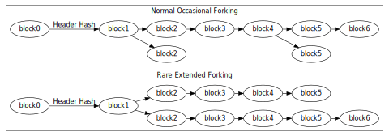

### 区块高度及分叉 | Block Height And Forking

任何成功计算出那个比目标阈值低的区块头哈希值的矿工，都可以将这整个区块加到区块链中（假设这个区块是有效的）。这些区块通常是通过区块高度来定位的，所谓区块高度是指某个区块与比特币第一个区块（及区块 0，众所周知的创世区块）之间的区块个数。比如，区块 2016 就是第一次难度调整的位置。



多个区块可以具有同样的区块高度，这在两个或更多的矿工同时创建一个区块时是很常见的。这导致了如上图所示的明显的分叉。

最终，矿工会产出一个新的区块，它附加在且仅附加在同时被挖出的区块中的一个之后。这样使得某一个分叉比其他分叉更为健壮。假设一个分叉只包括有效的区块，普通的节点总是跟随更长的链，而放弃陈旧的短的分叉。（陈旧的区块常常被叫做孤链，但是该术语也被用于描述确实没有父区块的区块。）

如果一些矿工有其他的意图，长期的分叉是有可能出现的，比如一些矿工在延续区块链工作，而同时另一些矿工试图通过发起 51％ 攻击篡改交易纪录。

因为多个区块可以在区块链分叉时具有同样的区块高度，所以区块高度不应该用来做全局的唯一标示符。通常，区块使用区块头的哈希值来做标示（大多数时候是字节倒序的十六进制表示）。

### 交易数据 | Transaction Data

每一个区块必须包含一笔或者多笔交易。这些交易的第一笔必须是一个 coinbase 交易，也被称作 generation 交易，它包含了这个区块所有花费和奖励（由一个区块的补贴和这个区块任何交易产生的交易费用构成）。

一个 coinbase 交易的 UTXO 有一个特殊的条件，那就是在之后的 100 个区块内都不能被花费（被用作输入）。这临时性的杜绝了一个矿工花费掉因为分叉而可能被判定为陈旧区块（这个 coinbase 交易因此被销毁掉）中所包含的补贴和交易费。

区块并不要求一定包含非 coinbase 的交易，但是矿工们为了把他们的交易手续费包含其中总是会带上额外的交易。

所有的交易，包括 coinbase 交易，都会被编码为二进制的 rawtransaction 格式存入区块。

通过对 rawtransaction 格式做哈希得到了交易标识符（txid）。从这些 txids 中，通过将一个 txid 与另一个 txid 配对然后做哈希运算，最终构建了 merkle 树。如果 txids 的个数为奇数，那么没有被配对的那个 txid 将会与他自身的一个副本配对做哈希。

以上得到的哈希值再一一配对，让一个哈希值与另一个再做哈希运算。任何没有可配对的哈希值与自身配对做哈希。这个过程迭代进行直到只剩下一个哈希值，这就是 merkle 根节点。

例如，如果交易只是连接（没有做哈希运算）在一起，那么具有 5 个交易的 merkle 树应该如下图所示：

```
       ABCDEEEE .......Merkle 根节点
      /        \
   ABCD        EEEE
  /    \      /
 AB    CD    EE .......E 与它自身配对
/  \  /  \  /
A  B  C  D  E .........交易
```

在[简化支付验证（SPV）](https://bitcoin.org/en/glossary/simplified-payment-verification)提案中指出，merkle 树允许客户端通过一个完整节点从一个区块头中获取其 merkle 根节点和中间哈希值列表来验证一个交易被包含在这个区块中。这个完整节点并不需要是可信的，因为伪造区块头十分困难而中间哈希值是不可能被伪造的，否则验证就会失败。

例如，要验证交易 D 被加到了区块中，一个 SPV 客户端只需要一份 C，AB 和 EEEE 的副本进而做哈希运算得到 merkle 根节点，客户端并不需要知道任何其他交易的信息。如果这 5 个交易的大小都是一个区块的最大上限，那么下载整个区块需要下载 500,000 个字节，但下载树的哈希值和区块头仅仅需要 140 个字节。

注意：如果在同一个区块中找到了相同的 txids，那么 merkle 树可能会出现与另一个区块的碰撞，归因于 merkle 树对非平衡的实现（对孤立的哈希值做复制）会将一个区块中一些或全部的重复内容移除掉。从对于单独的交易具有相同的 txid 是不现实的角度来看，merkle 树的实现不会对诚实的软件增加负担，但如果一个区块的无效状态要被缓存那么就必须做检查，否则，一个移除了重复交易的有效区块会因为具有相同的 merkle 根节点和区块哈希而被缓存的无效状态拒绝，导致了编号为 [CVE-2012-2459](https://en.bitcoin.it/wiki/CVEs#CVE-2012-2459) 的安全问题。

### 一致性规则变更 | Consensus Rule Changes

为了维持一致性，所有的完整节点使用相同的一致性规则验证区块。然后，有时为了加入新特性或者防治[网络](https://bitcoin.org/en/developer-guide#term-network)滥用一致性规则会被更改。当新的规则被实施后，会在一段时间内出现已更新节点遵循新的规则而未更新的节点遵循旧的规则，这导致两种可能的一致性分歧的出现：

1. 一个区块遵循新的一致性规则，它将被已更新节点接受而被未更新节点拒绝。例如，一个新的交易特性被用于区块内部，那么已更新节点便可以理解这一特性并接受它，但是未更新节点则因为它违背了旧的规则而拒绝了它。

2. 一个区块违反了新的一致性规则而被已更新节点拒绝，但却被未更新节点接受。例如，一个不合理的交易特性被用在一个区块内，已更新的节点因为新规则拒绝了它，但未更新的节点遵循旧的规则所以接受了它。

在第一种情况中，即未更新节点拒绝的情况，从未更新节点获取到区块链信息的挖矿软件会拒绝从已更新节点获取数据的挖矿软件在同一条链条上构建区块。这样导致了永久性的分叉链，一条是已更新节点的，一条是未更新节点的，这被称为[硬分叉](https://bitcoin.org/en/glossary/hard-fork)。


在第二种情况中，即已更新节点拒绝的情况，如果已更新节点掌握大部分的算力就有可能避免永久性分叉。在这种情况下，因为未更新节点会和已更新节点接受相同的区块而使已更新节点构建了更长的链，这样未更新节点便会接受更长的有效区块链。这被称作[软分叉](https://bitcoin.org/en/glossary/soft-fork)。


尽管一个分叉在区块链中是一个实实在在的分歧，但是对一致性规则的更改被经常描述为有可能出现软分叉或者硬分叉。比如，“扩展区块大小上限到 1 MB 需要一个硬分叉。”在这个例子中，一个区块链的硬分叉并不是一定需要，但是他却是一种可能的结果。

资源：[BIP16](https://github.com/bitcoin/bips/blob/master/bip-0016.mediawiki)，[BIP30](https://github.com/bitcoin/bips/blob/master/bip-0030.mediawiki) 和 [BIP34](https://github.com/bitcoin/bips/blob/master/bip-0034.mediawiki) 的实现被当作可能导致软分叉的变更。[BIP50](https://github.com/bitcoin/bips/blob/master/bip-0050.mediawiki) 描述了一种意外的硬分叉（通过暂且对已更新节点降级来化解）和一种当暂且的降低被移除后的有意的硬分叉。由 Gavin Andresen 写的一篇文档描绘[未来的规则更改该如何实现](https://gist.github.com/gavinandresen/2355445)。

### 发现分叉 | Detecting Forks

