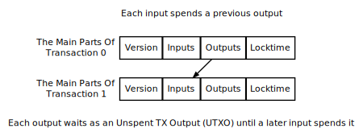
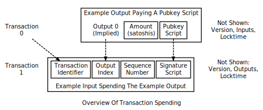

## 交易 | Transactions

交易让用户可以花费聪（satoshis）。每一笔交易是由多个部分构成的，使单纯直接的支付和复杂的交易成为可能。这一章节将对其每一部分做详解并展示如果将它们拼接起来构建一个完成的交易。

为了便于理解，这一节假设不存在 coinbase 交易。只有比特币矿工可以创建 coinbase 交易，它们对于下面会提到的很多规则都将是例外。这里并不会指出 coinbase 对哪一条规则是例外，你可以通过阅读本指南中区块链章节中的 coinbase 交易小节来做了解。

上图展示了一个比特币交易的主要部分。每一个交易至少有一个输入和一个输出。每一个输入会花费掉上一个输出的聪。一个输出会作为一个未花费交易输出（UTXO）等待着作为输入被花费掉。当你的比特币钱包显示你有 10,000 聪余额时，它真实的表意是你有 10,000 聪作为 UTXOs 在等待着。

每一个交易具有一个四字节的交易版本号，它告知比特币节点和矿工应使用哪一套规则来验证它。这使得开发者在为未来的交易创建新规则时可以不验证之前的交易。

每一个输出都有一个默认的索引数值，由其在交易中的位置决定，第一个输出就是输出零。输出包含以聪为计数单位的金额，通过满足一个特定条件的 pubkey 脚本来支付。任何可以满足 pubkey 脚本特定条件的人都可以花费对应金额的聪。